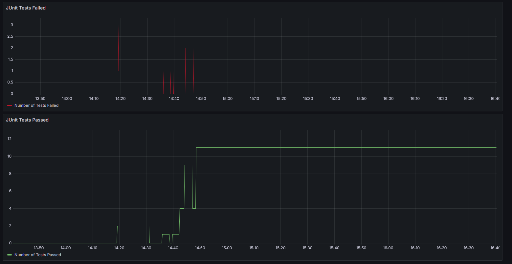

# UserService

## What is this?
This is a public repository with code that deploys itself and pushes to a confluent topic. It uses my Confluent creds and
my AWS creds. If the pipeline is run, it deploys and runs as an AWS AppRunner application.

## Application
The application is built using Spring Boot, auto generating Users and pushing them to a Kafka topic in Confluent Cloud. It
uses the @Scheduled annotation to push a new user to the topic on a recurring basis.

On successfully pushing the data to the topic, the result is logged as a metric for consumption in Prometheus (although 
you can't actually use AWS Prometheus to scrape from a serverless service so a push gateway is needed).

There is also an API controller (2, versioned) that allows pushing data to the topic via an API. Swagger for each POST request
can be seen at http://(app_runner_dns_host)/swagger-ui/index.html.

## Testing
### Unit
The unit tests use Mockito to mock the various components used in a service and then inject them into the service under test.
Unit testing focuses on code logic, making sure each of the small units that makes up a service works properly. They run
in very little time and should steer clear of using the @SpringBootTest annotation as we don't need the full Spring context
to run tests. 

### Integration
The integration tests use testcontainers and focus on booting up the service and interacting with dockerised containers to 
check that communications behave as expected. These tests take a bit longer to run, and can use things like consumers and
real HTTP requests to check that they're capable of performing as expected. No mocks are injected into these services as we
want the service to behave as much like a deployed service as possible.

As per the Test Pyramid, we should have way more unit tests that integration tests. Integration tests are more expensive in
terms of time to run, so should be used more sparingly and check the overall capability of the service under test. For a
complete platform, we'd have hundreds of unit tests, tens of integration tests and a handful of e2e tests, as an example of
how the pyramid would be formed.

## Deployment
The project is built and deployed using GitHub workflows, found [here](.github/workflows/gradle.yml). The workflow builds the
project, including the dockerise task. 

The workflow then moves onto the deployment section and pushes the dockerised container to my private ECR. App Runner is deployed
using terraform and pulls the image from ECR to run.

## Design Flow
The flow looks like the below:

## Metrics
### DORA
#### Lead Time for Change
Lead Time for Change is calculated using the GitHub API. It takes the initial commit time and subtracts it from the time at which the
deployment of the App Runner completes. This time can then be pushed to Compass, or Prometheus/Grafana etc to provide better visualisation.

*How to Capture*: This is currently captured in the github workflow, and should be pushed to a Prometheus Push Gateway.

#### Deployment Frequency
The Deployment Frequency is a measurement of how many deployments have been made over the past 7 days. This is best captured by recording
each deployment as a metric that can be collected over a specified period of time rather than this method, as collecting over 7 days here
doesn't give the kind of insight that helps determine trends.

*How to Capture*: This is currently captured in the github workflow, and should be pushed to a deployed Prometheus Push Gateway.

#### Mean Time To Resolve
This can be delegated fairly easily to PagerDuty. The PagerDuty API allows us to grab the MTTR for each of the alerts in a Production
environment, and can be collected to see the trends in resolution times.

*How to Capture*: This is currently captured in the github workflow, and should be pushed to a deployed Prometheus Push Gateway.

#### Change Failure Rate
This needs some input from both the CI/CD environment and something like Jira/PagerDuty to find the amount of issues found / changes made
in production. Change Failure Rate should be captured in a separate collector service.

### Tests
#### Test Coverage
The Test Coverage report data 

*How to Capture*: This is currently captured in the build.gradle, and is pushed to the local Prometheus Push Gateway.

#### Test Results
Test Results should be pushed to a Prometheus gateway after being run. This can be executed by running the docker compose file in
the docker directory, with the `docker-compose up` command. This will set up a Prometheus Push Gateway, a Prometheus server and
a Grafana Dashboard. Executing docker compose and running the tests will push the test results to the gateway, and on loading the
grafana dashboard JSON will show the test results like this:

*How to Capture*: This is currently captured by the [TestListener](src/integrationTest/java/com/chrisp1985/UserService/metrics/PrometheusTestListener.java), and is pushed to the local Prometheus Push Gateway.

### Prometheus Collection
The Prometheus yml scrapes from both the MetricsPushGateway hosted in AWS App Runner, and the local push gateway. The AWS hosted
push gateway is used to collect the results from the builds (for Deployment Frequency and LTTC) whilst the local push gateway can
be used for the tests.

In normal circumstances, everything would push to a centralised push gateway and get scraped by a prometheus server hosted in AWS,
but this is the least costly and easiest to set up .... setup I could do.

When the local prometheus scrapes the 2 push gateways, the data is then available for Grafana to display info on:

- JUnit Tests Passed.
- JUnit Tests Failed.
- Deployment Frequency.
- Lead Time To Change.