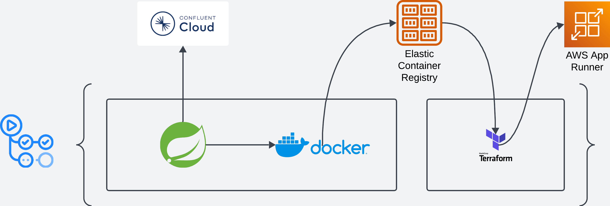

# UserService

## What is this?
This is a public repository with code that deploys itself and pushes to a confluent topic. It uses my Confluent creds and
my AWS creds. If the pipeline is run, it deploys and runs as an AWS AppRunner application.

## Application
The application is built using Spring Boot, auto generating Users and pushing them to a Kafka topic in Confluent Cloud. It
uses the @Scheduled annotation to push a new user to the topic on a recurring basis.

On successfully pushing the data to the topic, the result is logged as a metric for consumption in Prometheus (although 
you can't actually use AWS Prometheus to scrape from a serverless service so a push gateway is needed).

There is also an API controller (2, versioned) that allows pushing data to the topic via an API. Swagger for each POST request
can be seen at http://(app_runner_dns_host)/swagger-ui/index.html.

## Testing
### Unit
The unit tests use Mockito to mock the various components used in a service and then inject them into the service under test.
Unit testing focuses on code logic, making sure each of the small units that makes up a service works properly. They run
in very little time and should steer clear of using the @SpringBootTest annotation as we don't need the full Spring context
to run tests. 

### Integration
The integration tests use testcontainers and focus on booting up the service and interacting with dockerised containers to 
check that communications behave as expected. These tests take a bit longer to run, and can use things like consumers and
real HTTP requests to check that they're capable of performing as expected. No mocks are injected into these services as we
want the service to behave as much like a deployed service as possible.

As per the Test Pyramid, we should have way more unit tests that integration tests. Integration tests are more expensive in
terms of time to run, so should be used more sparingly and check the overall capability of the service under test. For a
complete platform, we'd have hundreds of unit tests, tens of integration tests and a handful of e2e tests, as an example of
how the pyramid would be formed.

## Deployment
The project is built and deployed using GitHub workflows, found [here](.github/workflows/gradle.yml). The workflow builds the
project, including the dockerise task. 

The workflow then moves onto the deployment section and pushes the dockerised container to my private ECR. App Runner is deployed
using terraform and pulls the image from ECR to run.

## Design Flow
The flow looks like the below:

